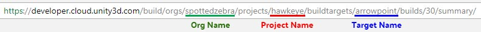

# Unity Cloud Build to Steam Uploader
I really enjoy using Unity's Cloud Build to create new versions of my game. It lets me focus on adding more features while a build cooks in the background. But uploading the new build still requires manual work on my part. I've got to find the build on Unity's website, download and unzip it, move it to the proper directory for upload, and execute Valve's Steamworks upload script. I just want to stay focused working on my game! 

The goal of this project is to automate the remaining manual steps. It does that by polling Unity Cloud Build for changes and uploading them automatically to Steam.

## Prerequisites
  * You're using Windows.
  * You have a Steam app registered and a depot set up.
  * You have Unity Cloud Build up and running.
  * You can execute PowerShell scripts.
  * You've downloaded the [Steamworks SDK][2]

### Getting Your Unity Cloud Build Information ###

You can find your API Key here: https://developer.cloud.unity3d.com/preferences/

From there, navigate to: Settings > Cloud Build > API Settings > API Key

To get the rest of the information, go to the summary for your most recent build. In the URL you will see the necessary pieces:

### Enable PowerShell Script Execution ###

   1. Open a PowerShell terminal as administrator
   1. Execute: `Set-ExecutionPolicy Unrestricted`

## Quick Start
Download and unzip the latest build here:

[UnityCloudBuildSteamUploader.zip][1]

Copy the following folders to  `$PROJECT\UnityCloudBuildSteamUploader\Steamworks_SDK`:

1. `$SDK\sdk\tools\ContentBuilder\builder`
1. `$SDK\sdk\tools\ContentBuilder\builder_linux`
1. `$SDK\sdk\tools\ContentBuilder\builder_osx`

Navigate to the project folder, open PowerShell, and run:

    Setup-Project.ps1

Follow the prompts to configure a project. You should run this script once for each project you want to set up. This script creates config files under `configs/` which you can safely edit.

Next we must disable Steam Guard. To do so run:

    Upload-SteamContent.ps1

And provide it with the file name of one of the config files generated in the previous step. This will prompt you to enter the Steam Guard code. You can then cancel the process, or let it finish (it will upload a blank build).

Note: You can use `Upload-SteamContent.ps1` as a means to manually upload builds to Steam. If you don't want to use Unity Cloud Build, just place your game's files under the corresponding content folder (defined in the game's project settings generated in the previous step) and run this script.

Finally run:

    BuildUploader.Console.exe

This program should be left running. It will check each project for new builds and upload them to Steam automatically. If the terminal is closed for whatever reason simply restart the program.

## Contributing
The following is intended for those who would like to change the tool. If you simply want to run the tool refer to the Quick Start section above.

### Installation

 * Open `BuildUploader.sln` in Visual Studio.
 * Restore Nuget packages.
 * Build the solution.

The generated exe and dependencies will be automatically copied to `UnityCloudBuildSteamUploader`. Use that directory to test changes. It also serves as the basis for creating new release.

### Original Implementation and Reference
Credit to Niklas Borglund for his guide detailing how to use Node.js and Gulp to scan for, download, and publish builds from Unity Cloud Build.

https://www.lavapotion.com/blog/2017/6/8/connecting-unity-cloud-build-and-hockeyapp-the-slightly-hackish-way

[1]: https://github.com/aschearer/UnityCloudBuildSteamUploader/releases/latest
[2]: https://partner.steamgames.com/downloads/steamworks_sdk.zip
